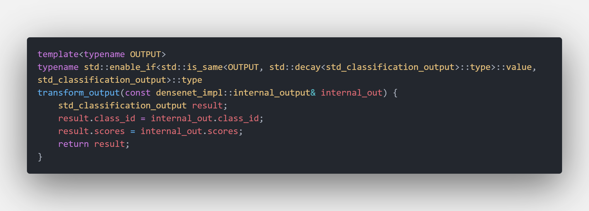

# 如何添加新的DL模型

下面是一个简要说明来介绍如何在该框架中增加一个新的DL模型. 所有DL模型都继承自 [jinq::models::BaseAiModel<INPUT, OUTPUT>](../src/models/base_model.h). `INPUT` and `OUTPUT` 是用户来定义的，这样设计的目的是为了将用户输入、用户输出和模型的核心运算尽量隔离开来避免耦合. 整个模型的运行主要分为三部分. 第一步是将用户自定义的输入转换成该算法模型内部定义的输入，通常是一个Opencv的Mat对象. 第二步进行模型的inference运算. 最终将该算法模型内部定义的输出转换成用户自定义的输出. 下面将介绍如何增加一个新的 `DenseNet` 图像分类新模型作为示例

## Step 1: 定义自己的模型输入数据结构 :cowboy_hat_face:

For example your model's input data type is a base64 encoded image. You may add the new input data in [model_io_define.h](../src/models/model_io_define.h)

例如你的模型输入是一个base64编码过的图像文件. 那么你将这种自定义模型输入写入 [model_io_define.h](../src/models/model_io_define.h)

```cpp
namespace io_define {
namespace common_io {
    struct base64_input {
        std::string input_image_content;
    };
} // namespace common_io
```

## Step 2: 定义自己的模型输出数据结构 :monkey_face:

对于新手来说一般使用内置默认的输出结构就可以了. 不同种类模型的输入可以在文件 [model_io_define.h](../src/models/model_io_define.h) 中找到. 那些被命名为 `std****output` 的就代表这默认输出格式.

例如图像分类模型的输出被定义为

```cpp
namespace classification {
    struct cls_output {
        int class_id;
        std::vector<float> scores;
    };
    using std_classification_output = cls_output;
} 
```

class_id 等于scores中最大值的索引号

图像目标检测的默认输出定义为

```cpp
namespace object_detection {
    struct bbox {
        cv::Rect2f bbox;
        float score;
        int32_t class_id;
    };
    using std_object_detection_output = std::vector<bbox>;
}
```

目标检测框 `bbox` 由位置 `bbox`, 类别 `cls_id` 和置信度 `score` 组成. 整个模型的输出则是一些列这种目标检测框

## Step 3: 实现从用户自定义输入到模型内部默认输入的转换方法 :dog:

通常情况下模型的默认输入都是一个OpenCV格式的Mat对象，这个可以在代码 [densenet.inl#L33-L35](../src/models/classification/densenet.inl) 查看到. 用户需要自己实现转换方法来实现用户自定义输入到模型默认输入的转换

For example if you defined a base64 encoded image as your input data type. Then you're supposed implement the transform funciton at [densenet.inl#L73-L94](../src/models/classification/densenet.inl)


例如你使用base64编码的图像作为模型输入，那么你需要实现类似 [densenet.inl#L73-L94](../src/models/classification/densenet.inl) 的转换函数来实现用户输入到模型默认输入的转换


## Step 4: Implement The Transform Function from User Defined Output to Model's Internal Output :pig_nose:

If you use the default output type then your transform function equals a simple assignment funciton like [densenet.inl#L96-L110](../src/models/classification/densenet.inl)


Of course you may define your own customized output data format.

## Step 5: Implement The `init` Interface Function :mouse:

Usually model's init function is used to setup model's interpreter, session, tensor resource and determinate the computing backend. You may checkout [densenet.inl#L199-L343](../src/models/classification/densenet.inl) for details. Init funciton's structure is

```cpp
/***
*
* @param config
* @return
*/
template<typename INPUT, typename OUTPUT>
StatusCode DenseNet<INPUT, OUTPUT>::Impl::init(const decltype(toml::parse(""))& config) {
    // do init task
    ...
    return StatusCode::OK;
}
```

## Step 6: Implement The `run` Interface Function :elephant:

This interface function is responsible for the main model inference process. Three major modules of this process are first transfor input second run model's session finally transfor output. The main code for densenet model is

```cpp
/***
 *
 * @tparam INPUT
 * @tparam OUTPUT
 * @param in
 * @param out
 * @return
 */
template<typename INPUT, typename OUTPUT>
StatusCode DenseNet<INPUT, OUTPUT>::Impl::run(const INPUT& in, OUTPUT& out) {

    // first transform external input into internal input
    auto internal_in = densenet_impl::transform_input(in);
    if (!internal_in.input_image.data || internal_in.input_image.empty()) {
        return StatusCode::MODEL_EMPTY_INPUT_IMAGE;
    }

    // second run session
    auto preprocessed_image = preprocess_image(internal_in.input_image);
    MNN::Tensor input_tensor_user(_m_input_tensor, MNN::Tensor::DimensionType::TENSORFLOW);
    auto input_tensor_data = input_tensor_user.host<float>();
    auto input_tensor_size = input_tensor_user.size();
    ::memcpy(input_tensor_data, preprocessed_image.data, input_tensor_size);
    _m_input_tensor->copyFromHostTensor(&input_tensor_user);
    _m_net->runSession(_m_session);
    MNN::Tensor output_tensor_user(_m_output_tensor, MNN::Tensor::DimensionType::TENSORFLOW);
    _m_output_tensor->copyToHostTensor(&output_tensor_user);
    auto* host_data = output_tensor_user.host<float>();

    // finally transform output
    densenet_impl::internal_output internal_out;
    for (auto index = 0; index < output_tensor_user.elementSize(); ++index) {
        internal_out.scores.push_back(host_data[index]);
    }
    auto max_score = std::max_element(host_data, host_data + output_tensor_user.elementSize());
    auto cls_id = static_cast<int>(std::distance(host_data, max_score));
    internal_out.class_id = cls_id;
    out = densenet_impl::transform_output<OUTPUT>(internal_out);

    return StatusCode::OK;
}
```

## Step 7: Add New Model Into Task Factory :factory:

Task factory is used to create model object. Details about this can be found [classification_task.inl#L86-L98](../src/factory/classification_task.h)

```cpp
/***
 * create densenet image classification
 * @tparam INPUT
 * @tparam OUTPUT
 * @param detector_name
 * @return
 */
template<typename INPUT, typename OUTPUT>
static std::unique_ptr<BaseAiModel<INPUT, OUTPUT> > create_densenet_classifier(
    const std::string& classifier_name) {
    REGISTER_AI_MODEL(DenseNet, classifier_name, INPUT, OUTPUT)
    return ModelFactory<BaseAiModel<INPUT, OUTPUT> >::get_instance().get_model(classifier_name);
}
```

## Step 8: Make A Benchmark App For New Model :airplane:

You have already add a new ai model till this step. Now let's make a benchmark app to verify your new model. Comple code can be found [densenet_benchmark.cpp](../src/apps/model_benchmark/classification/densenet_benchmark.cpp)

```cpp
int main(int argc, char** argv) {

    // construct model input
    std::string input_image_path = "../demo_data/model_test_input/classification/ILSVRC2012_val_00000003.JPEG";
    cv::Mat input_image = cv::imread(input_image_path, cv::IMREAD_COLOR);
    struct mat_input model_input {
            input_image
    };
    std_classification_output model_output{};

    // construct detector
    std::string cfg_file_path = argv[1];
    LOG(INFO) << "config file path: " << cfg_file_path;
    auto cfg = toml::parse(cfg_file_path);
    auto classifier = create_densenet_classifier<mat_input, std_classification_output>("densenet");
    classifier->init(cfg);
    if (!classifier->is_successfully_initialized()) {
        LOG(INFO) << "densenet classifier init failed";
        return -1;
    }

    // run benchmark
    int loop_times = 1000;
    LOG(INFO) << "input test image size: " << input_image.size();
    LOG(INFO) << "classifier run loop times: " << loop_times;
    LOG(INFO) << "start densenet benchmark at: " << Timestamp::now().to_format_str();
    auto ts = Timestamp::now();
    for (int i = 0; i < loop_times; ++i) {
        classifier->run(model_input, model_output);
    }

    auto cost_time = Timestamp::now() - ts;
    LOG(INFO) << "benchmark ends at: " << Timestamp::now().to_format_str();
    LOG(INFO) << "cost time: " << cost_time << "s, fps: " << loop_times / cost_time;

    LOG(INFO) << "classify id: " << model_output.class_id;
    auto max_score = std::max_element(model_output.scores.begin(), model_output.scores.end());
    LOG(INFO) << "max classify socre: " << *max_score;
    LOG(INFO) << "max classify id: " << static_cast<int>(std::distance(model_output.scores.begin(), max_score));

    return 1;
}
```

If nothing wrong happened :smile: you should get a similar benchmark result like

`densenet benchmark result`


Good Luck !!! :trophy::trophy::trophy:

## Reference

Complete implementation code can be found

* [DenseNet Model Implement](../src/models/classification/densenet.inl)
* [DenseNet Model BenchMark App](../src/apps/model_benchmark/classification/densenet_benchmark.cpp)
