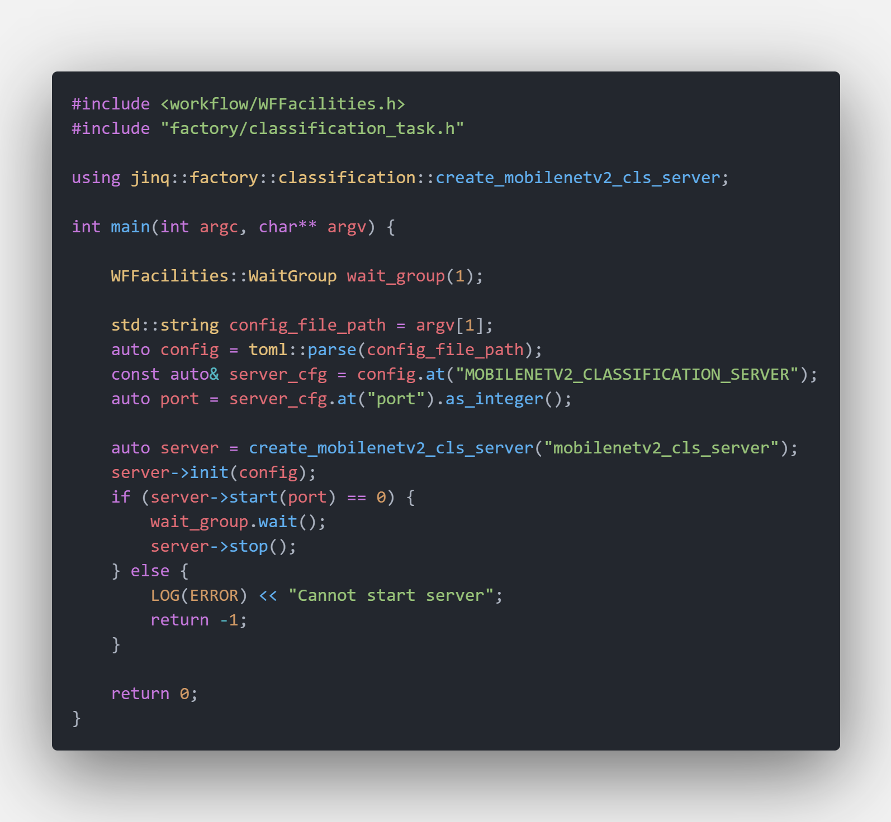
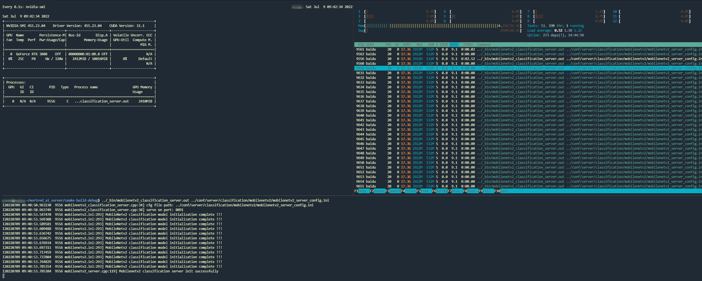
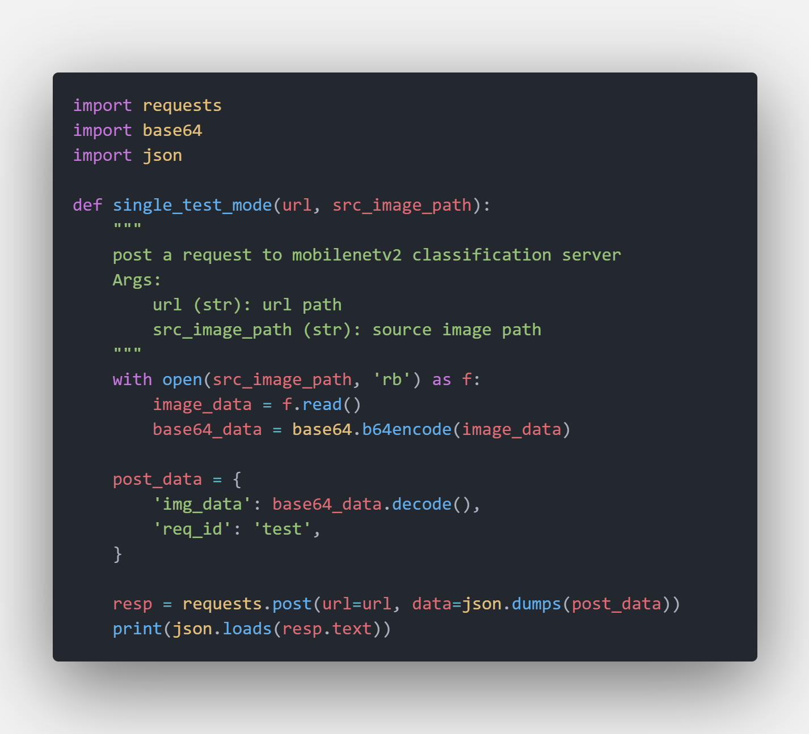
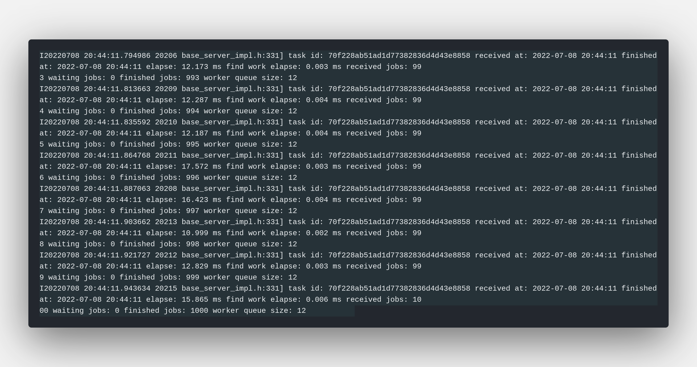
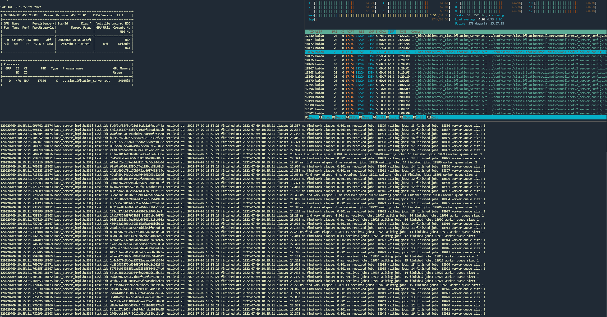
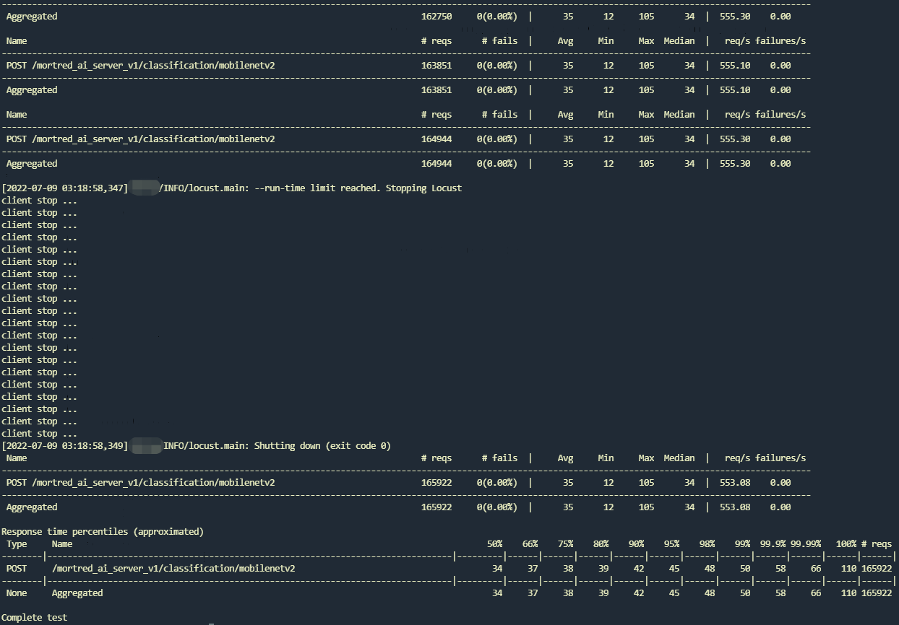

# 图像分类服务器说明

## 启动一个图像分类服务器

你可以快速启动一个图像分类服务器. 主要的函数如下所示

`图像分类服务器代码段`


编译好的可执行文件存放在 `$PROJECT_ROOT/_bin/mobilenetv2_classification_server.out`, 启动方式如下所示

```bash
cd $PROJECT_ROOT/_bin
./mobilenetv2_classification_server.out ../conf/server/classification/mobilenetv2/mobilenetv2_server_config.ini
```

正常启动后，服务会运行在 `http:://localhost:8091`, `worker_nums` workers会被唤醒占用你的GPU资源。默认情况下4个worker实例会被创建出来，当然你可以依你的gpu情况适量增大或者减少实例个数。

`图像分类服务器被正常启动`


## Python 客户端示例

在文件 [test_server.py#L39-L67](../scripts/server/test_server.py) 处有一个简单的python客户端代码来测试上述启动的server，你可以很容易的post一个请求

`python客户端代码片段`


服务的url地址可以在服务启动之前在配置文件中进行配置修改。你可以在 [模型服务器配置说明文档](../docs/about_model_server_configuration.md) 中找到详细说明。

调用python客户端的方式如下

```python
cd $PROJECT_ROOT/scripts
export PYTHONPATH=$PWD:$PYTHONPATH
python server/test_server.py --server mobilenetv2 --mode single
```

在 `single` 模式下，客户端会顺序发送 [默认测试图像](../demo_data/model_test_input/classification/ILSVRC2012_val_00000003.JPEG) 1000次

`mobilenetv2 图像分类服务器输出`


`mobilenetv2 图像分类客户端输出`


你可以从服务端返回的response信息中获取图像的分类结果和具体置信度分数。

## Python 客户端代码说明

[test_server.py](../scripts/server/test_server.py) 所创建的简单python客户端不仅支持顺序发送并且支持基于locust的并发压测模式。

客户端使用的配置文件存放在 [py_demo_scripts_cfg.yaml](../conf/py_demo/py_demo_script_cfg.yaml).

`Python客户端配置文件示例`


**URL:** 服务的url地址

**SOURCE_IMAGE_PATH:** post的图像文件地址

**MODE:** 目前客户端只支持 `single` 和 `locust` 两种模式. `single` 模式下客户端会顺序发送 `SOURCE_IMAGE_PATH` 图像 `LOOP_TIMES` 次。`locust`模式下会并发多个请求。

**U:** 客户端最大并发数

**R:** 每秒增加的客户端数量

**T:** 压测持续时间

关于 `Locust` 库的详细文档可以查询 [locust documents](https://docs.locust.io/en/stable/)

启动python客户端进行压测的方式如下

```python
cd $PROJECT_ROOT/scripts
export PYTHONPATH=$PWD:$PYTHONPATH
python server/test_server.py --server mobilenetv2 --mode locust
```

在使用默认配置的4个模型实例情况下服务端和客户端的输出如下图所示

`压测模式下的客户端输出`


`压测模式下的服务端输出`


正如上述输出看到压测结果，服务端只能达到288 req/s，平均响应时间为68ms，最小响应时间为13ms，这个结果显然不能让人满意。当你仔细观察服务器gpu资源你会发现gpu利用率其实是不高的，甚至某些请求会计算超时，并且 `worker queue` 持续为空。这种情形下可以尝试增大服务器配置文件中的 `worker_nums` 来提高整个服务器的吞吐。


下面让我们增大 `worker_nums` 到12来看看效果如何


你可以看到几乎没有超时的请求再次出现并且 `worker queue` 不会持续性枯竭，服务器上的gpu利用率也提升了不少。压测结果显示平均响应时间减少到了35ms，最小响应时间13ms，rps则提升到了546 req/s 这个数据几乎和本地的模型基准测试结果无二了 :fire::fire::fire:


当然你不能通过无限制的增大 `worker_nums` 来获取服务性能上的增益，例如当增大 `worker_nums` 到24的时候压测的 `rps` 数据几乎没有什么提升

