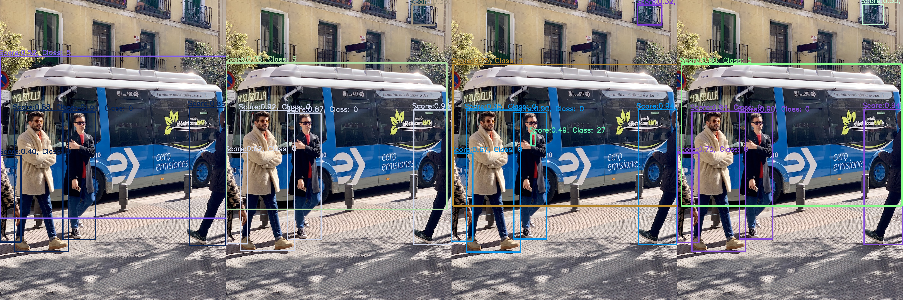
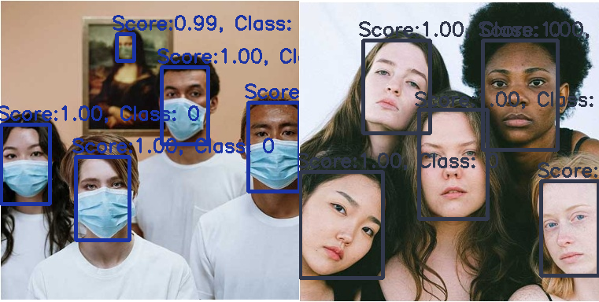

# 图像目标检测服务器说明

## 启动图像目标检测服务器

目标检测服务器主要代码如下

`图像目标检测服务器代码段`


编译好的文件存放在 `$PROJECT_ROOT/_bin/yolov5_detection_server.out`。运行

```bash
cd $PROJECT_ROOT/_bin
./yolov5_detection_server.out ../conf/server/object_detection/yolov5/yolov5_server_config.ini
```

默认状态下服务会启动在 `http:://localhost:8091` 并且有4个模型实例被启动。你可以通过修改模型配置来使用不同的yolov5模型，比如 `yolov5s`、`yolov5m`、`yolov5x` etc

## Python 客户端示例

测试仅需运行

```python
cd $PROJECT_ROOT/scripts
export PYTHONPATH=$PWD:$PYTHONPATH
python server/test_server.py --server yolov5 --mode single
```

## 关于目标检测服务器的一些特殊说明

目标检测服务器的输出是属于一张图像上的一系列目标框。目标框由位置、类别和置信度构成。服务端的response json对象结构如下

```python
resp = {
    'req_id': '',
    'code': 1,
    'msg': 'success',
    'data': [
        {
            'cls_id': 6,
            'score': 0.65,
            'points': [[tl_x, tl_y], [rb_x, rb_y]],
            'detail_infos': {}
        },
        {
            ...
        },
    ]
}
```

## 关于人脸检测服务器的一些特殊说明

人脸检测服务器的输出是属于一张图像上的一系列人脸框。人脸框由位置、landmarks和置信度构成。服务端的response json对象结构如下

```python
resp = {
    'req_id': '',
    'code': 1,
    'msg': 'success',
    'data': [
        {
            'cls_id': 6,
            'score': 0.65,
            'box': [[tl_x, tl_y], [rb_x, rb_y]],
            'landmark': [[x1, y1], [x2, y2], [x3, y3], ...]
        },
        {
            ...
        },
    ]
}
```

## 目标检测服务器的可视化结果示例

### Yolov5 模型

Yolov5 :rocket: 是一个 **niubi** 的目标检测模型。

`客户端输入图像`


`服务器输出图像`




### LibFcae Model

Libface 是由 [ShiqiYu](https://github.com/ShiqiYu) 老师出品的杰出人脸检测模型. 你可以参考 [https://github.com/ShiqiYu/libfacedetection](https://github.com/ShiqiYu/libfacedetection) 来获取模型细节。

`客户端输入图像`


`服务端输出图像`

