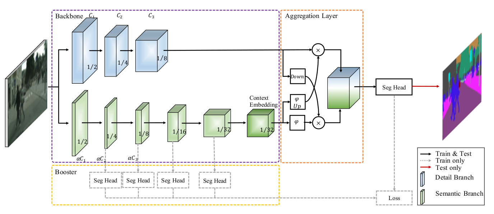

# Tutorials Of Scene Segmentation Model Server

## Start A Scene Segmentation Server

It's very quick to start a scene segmentation server. Main code are showed below

`Scene Segmentation Server Code Snappit`


The executable binary file was built in $PROJECT_ROOT/_bin/bisenetv2_segmentation_server.out Simply run

```bash
cd $PROJECT_ROOT/_bin
./bisenetv2_segmentation_server.out ../conf/server/scene_segmentation/bisenetv2/bisenetv2_server_config.ini
```

When server successfully start on `http:://localhost:8091` you're supposed to see `worker_nums` workers were called up and occupied your GPU resources. By default 4 model workers will be created you may enlarge it if you have enough GPU memory.

## Python Client Example

Local python client test is similiar with mobilenetv2 classification server you may read [toturials_of_classfication_model_server.md](../docs/toturials_of_classification_model_server.md) for details.

To use test python client you may run

```python
cd $PROJECT_ROOT/scripts
export PYTHONPATH=$PWD:$PYTHONPATH
python server/test_server.py --server bisenetv2 --mode single
```

## Unique Tips For Scene Segmentation Model Python Client

Scene Segmentation model's output is a class map with the same image size of origin input image. Each pixel was assigned with a unique class label. Server's response is a json like

```python
resp = {
    'req_id': '',
    'code': 1,
    'msg': 'success',
    'data': {
        'segment_result': base64_image_content
    }
}
```

`segmentation_result` contains the model's output encoded with base64. If you want to save the model's output info local file you may do

```python
with open(src_image_path, 'rb') as f:
    image_data = f.read()
    base64_data = base64.b64encode(image_data)

    post_data = {
        'img_data': base64_data.decode(),
        'req_id': 'demo',
    }
    resp = requests.post(url=url, data=json.dumps(post_data))
    output = json.loads(resp.text)['data']['segment_result']
    out_f = open('result.png', 'wb')
    out_f.write(base64.b64decode(output))
    out_f.close()
```

## Scene Segmentation Model's Visualization Result

### BisenetV2 Model

[BisenetV2](https://arxiv.org/abs/2004.02147) :fire: model was designed for fast scene segmentation task. You may refer to repo https://github.com/MaybeShewill-CV/bisenetv2-tensorflow for details about training details.

Network's main structure is
`Bisenetv2 Network Architecture`


`Server's Input Image`


`Server's Output Image`

